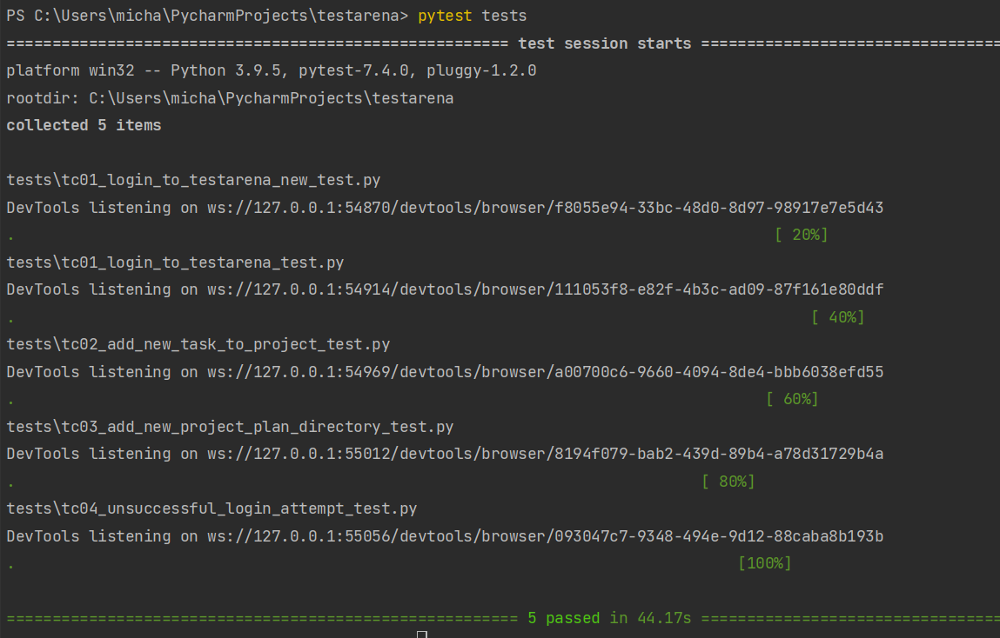

#Test Arena

##Installation (linux)

###Install Python
```
https://phoenixnap.com/kb/how-to-install-python-3-ubuntu
```
###Install PIP
```
curl https://bootstrap.pypa.io/get-pip.py -o get-pip.py
python3 get-pip.py
```
##Installation (windows)
```
Install any IDE ;)
```
##Install libraries
```
pip install pytest
pip install selenium
```
##How to use
```
pytest tests
```
